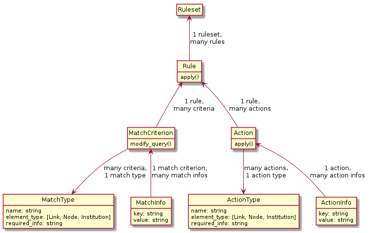

# Collation Rules

Collation is the process of integrating new data into an existing map data set.  It may update data in an existing Topology, or add a new Topology.

There will inevitably be issues when data is refreshed or data sources are combined.  Updating data manually is not ideal because these updates may be overridden the next time data is ingested again.  Instead, a Data Administrator may define a set of "Rules" that run every time the database is changed, so that desired changes are always applied after every refresh.

For more information, see the user manuals for [polling](../user/polling.md) and [collation](../user/collation.md).

## Model entities

The entity model shows the elements a Rule is made of, and how these elements are related to each other and to the Rule.

It doesn't say how to select records or how to modify them. It only gives us places to store information that will be used by the code that applies Rules.



An arrow represents a foreign key field.

`B --> A` means:
- `B` has a foreign key field that refers to `A`.
- If we have an instance of `B` called `b`, we can access the related instance of `A` with the expression `b.a`.
- We can access the instances of `B` connected to `A` with `a.b_set`.

## `Rule.apply` method

Steps the method takes when it runs:

1. Verify that the Rule is complete (all required MatchInfo and ActionInfo keys) and consistent (Matches and Actions apply to the same Element types).

2. Collects all of the Elements specified by MatchCriteria and Actions in the DB.

3. Filters the Elements progressively by each MatchCriterion (akin to 'AND' clauses).

4. Applies each Action, in order, on the final filtered set of Elements.

## Developing Match Types and Action Types

Match Types are instructions for filtering Elements in various ways in Rules.
Action Types are instructions for modifying matched Elements in Rules.
Each of these are implemented via modular subclasses of BaseMatchType and BaseActionType, respectively.

This is the procedure to develop a new BaseMatchType or BaseActionType:

1. Create a new file in django/collation/match_types/ or .../action_types/
2. It is recommended to use an existing file in the directory defining a BaseMatchType or BaseActionType as a template for header, import statements, and class structure.
3. Class methods:
    - For **Match Types**, the important class method of a BaseMatchType subclass is **filter(self, elements_query)**.  It takes a QuerySet of Elements (Institutions, Nodes, and Links), applies further QuerySet filtering, and returns that QuerySet for chaining of Match Criteria.
    - For **Action Types**, the important class method of a BaseActionType subclass is **apply(self, elements)**.  It takes a single element, and executes its defined action on it.  It returns a tuple:
      1. The equivalent element to what was passed in, if applicable (i.e. the element was not deleted).  This is important, as the next Action in a chain will require an accurate reference.  While this will usually be straightforward, sometimes it is less so: for example, if the Action is a "Replace With", the next Action in the chain should operate on the element with which this one was replaced, not the one that was discarded in favour of the target.
      2. An ActionLog instance indicating what has occurred as the Action was applied.
4. Class properties and documentation:
    - **'name'** property: The name by which this Type will be referred to when the Administrator is constructing Rules.  The name should clearly and concisely describe the intent of the Match or Action, and include the type of Element to which it applies.  For example, "Merge Link Into".
    - **'element_type'** property: The type of element this Match Type or Action Type applies, either  collation.constants.ElementTypes.Institution, .Node, or .Link.  All Match Types and Action Types within a given Rule must apply to the same type of Element for the Rule to validate and run.
    - **'required_info'** property: Match Criteria and Actions may be required to specify more information for a particular Match Type or Action Type to function.  For example, Match Link By ID must be given the ID of the Link to match; the Administrator must provide this via a MatchInfo with key "ID" and value of the desired ID.  This property is a list of required MatchInfo keys.  In the example here, it would be just one item: ['ID'].
    - Class **docstring**: The docstring for each BaseMatchType and BaseActionType subclass serves two purposes: to aid developers, as usual, but also to aid an Administrator in constructing Rules.  Be sure to keep both target audiences in mind when writing the docstring.  This docstring should verbosely describe the operation of the Match or Action, sufficient to introduce it to someone completely unfamiliar with it.  (A familiarity with how Rules work in general may be assumed.)  Since this text may be shown to users of the system, it must be included in the translation matrix.  This is accomplished by providing the docstring in a slightly different format from the standard Python PEP8 docstring.  Prefix each class with a base_app.utils.decorators.translated_docstring decorator, with the docstring as the only parameter, but wrapped in a no-op gettext function:
      ```
      @translated_docstring(gettext_noop("""Docstring here"""))
      class MyMatchType(BaseMatchType):
          ...
      ```

### By-ID Match Types Are Special

The most basic form of matching, by GRENML ID, is used as an archetype, an example, and a fundamental building block for unit and functional tests, so changes to these basic MatchTypes should be made very warily and carefully.

## Collation Rulesets

Rules exist as members of Rulesets. Rulesets can be used to logically group related Rules, at the data administrator's discretion.

`Ruleset.apply` method will execute the rules contained in this ruleset. The order in which the method applies the rules is undefined. Any exception during executing each rule will be skipped and logged so that all the rules can get run.
