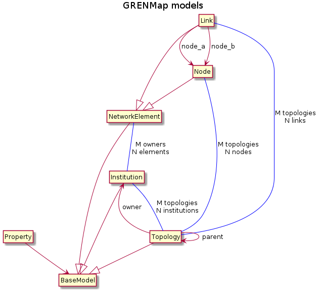

# The Django ORM models for the components of a GRENML file

Located in `/django/network_topology/models/`. The files in this directory contain the Django ORM models for the components of a GRENML file.



## Network Element

The basic abstract class of the schema is the Network Element. Most classes inherit from it. A Network Element has an "id" attribute which is a persistent, unique identifier. The ID should typically be, in order of preference:  
* a URN,  
* a hash of an official internal ID,  
* a UUID,  
* or in some cases, a special reserved string.

```python
class NetworkElement(models.Model):  
    """
    Base model for representing network elements in GRENML
    """
```

### Node

A Node is generally a device connected to, or part of, the network. Node inherits from Network Element. In network parlance, a Node could represent a connected institution, a POP, an amplifier/repeater, or any other kind of site. Nodes typically represent potential endpoints for Links.

A Node may have the following attributes:  

* *id* : a persistent unique identifier
* *name* : a human readable string
* *short_name* : an abbreviated label
* *type* : node type, the value of which should be one of the following: “Core”, “Virtual”, “InternetExchange”, …
* *owners* : a list of ownership

```python
class Node(NetworkElement, Lifetime, Location):  
    """
    Represents a point with extendable attributes on the map
    """
```

### Link

A Link is an end-to-end path between 2 nodes. Link inherits from Network Element.

A Link may have the following attributes:

* *id* : a persistent unique identifier
* *name* : a human readable string
* *shortName* : an abbreviated label
* *node_a* : the first node in the link
* *node_b* : the second node in the link
* *type* : Link type, the value of which should be one of the following: “Terrestrial”, “Submarine”, “Virtual”, …
* *owners* : a list of ownership

```python
class Link(NetworkElement, Lifetime):  
    """
    Represents a link between 2 nodes on the map
    """
```

## Topology

It is a container for nodes, links and institutions.  Typically, each Research and Education Network gets a single Topology, and they are nested according to geographic or organizational hierarchies, in the hierarchical distributed database structure established by polling.  However, it is possible to use subtopologies to further organize data.

As mentioned above, Topologies are hierarchical: a topology can have child topologies. A topology's ForeignKey attribute `parent` is a reference to its immediate ancestor. The root topology in a server is the only instance which doesn't have a parent.

Every GRENML file has a root topology.

Every topology should have an owner institution.

When the server is first started and initializes its database, it creates a default root topology. The server administrator must then provide an owner institution for the root topology, otherwise import and export operations will fail.

Topologies are in M-to-N relationships with nodes, links and institutions. Any instance of these entities that is associated to a single topology disappears if that topology is deleted by an administrator.

There are shortcuts to select elements inside Topologies, such as:
```python
topology.institutions.all()
topology.nodes.filter(...)
topology.links.exclude(...)
```

## Property

Represents additional custom defined values for a GRENML element

   class Property(models.Model):  
    """
    Represents additional custom defined values for a GRENML element. The property name will be all lower case.
    """

## Location

A Location is a reference to a geographical location or area. Designed to be subclassed with
multiple inheritance by any model requiring an address.

A Location may have the following attributes:  
* *longitude* : the longitude in WGS84 coordinate system (in decimal degrees)  
* *latitude* : the latitude in WGS84 coordinate system (in decimal degrees)  
* *address* : An address property  
* *city* : the city name  
* *province* : full Province/State name  
* *postal_code* : Postcode/Zipcode  
* *country* :  ISO 3166-1 two-letter country code  

```python
class Location(models.Model):  
    """
    A Location is a reference to a geographical location or area.
    Designed to be subclassed with multiple inheritance by any model
    requiring an address.
    """
```

## Institution

Institutions may be: RENs (RREN, NREN, RAN), connected institutions (universities, …), or any
other organization participating in the topology.

An institution may have the following attributes:  
* *id* : a persistent unique identifier  
* *name* : a human readable string  
* *type* : may be: RREN, NREN, RAN, University, …

```python
class Institution(Location):  
    """
    Institutions may be: RENs (RREN, NREN, RAN), connected institutions
    (universities, …), or any other organization participating in the
    topology.
    """
```

## Lifetime

A Lifetime is an interval between which the object is said to be active. This can be used to
track changes in a network, reflect dynamic operations, to help debug problems, et cetera.

A Lifetime may have the following attributes:  
* *start* : the start time  
* *end* : the end time

```python
class Lifetime(models.Model):  
    """
    An interval between which the object is said to be active.
    The time and date formatted as ISO 8601 calendar date, and should
    be a basic (compact) representation with UTC timezone
    """
```
